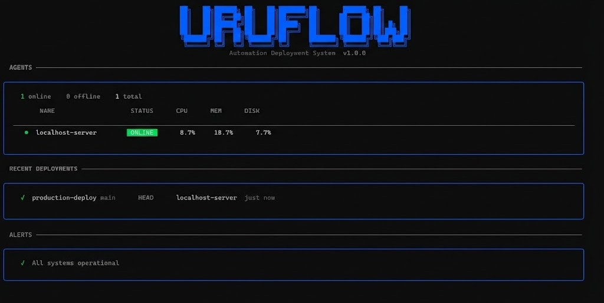
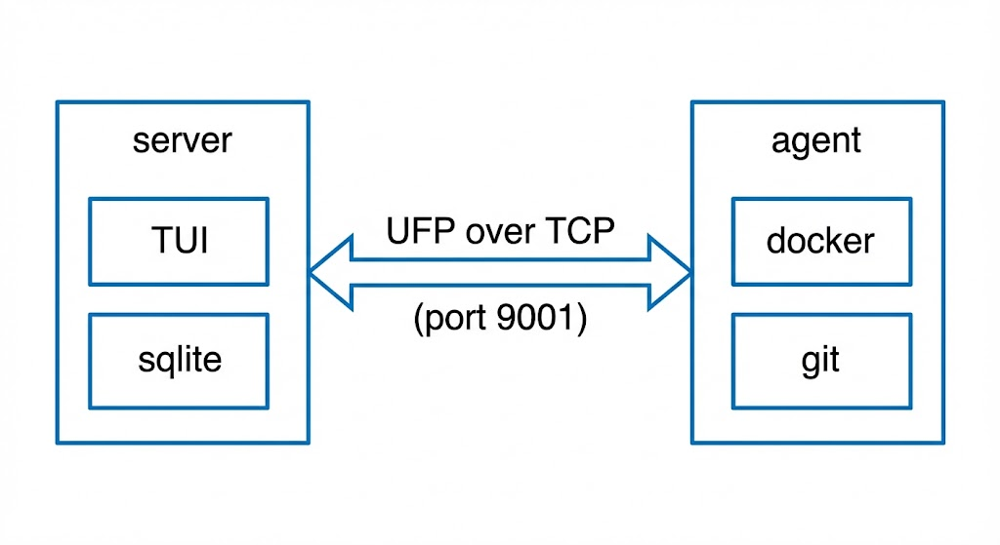
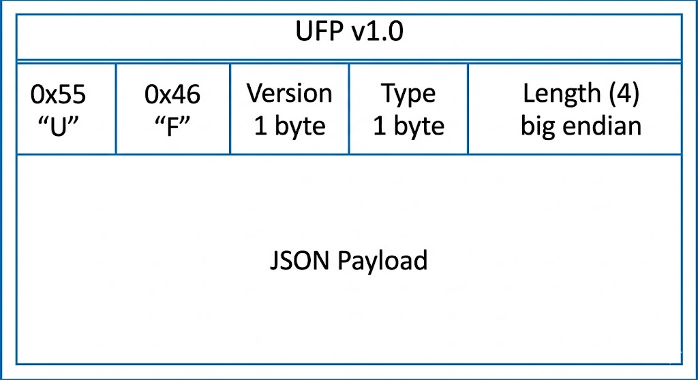
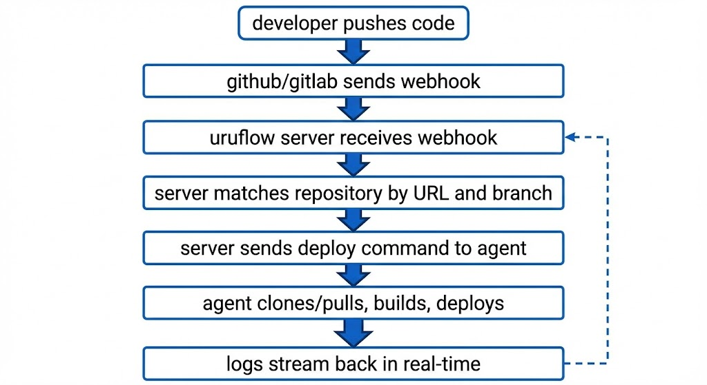
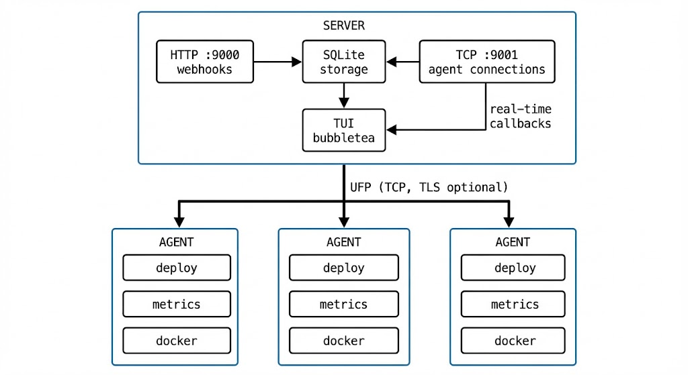

<h1 align="center">URUFLOW</h1>

<p align="center">
  the automated deployment engine built for developers who live in the terminal.
</p>

<p align="center">
<a >
  
</a>
  <a>
    
  </a>
  <a>
    
  </a>
  <a>
    
  </a>
</p>

<br>

<p align="center">
  
</p>

## what is uruflow?

uruflow is a self-hosted deployment system that bridges the gap between simple scripts and complex enterprise ci/cd.

it connects your git repositories directly to your infrastructure. you push code, it deploys. it runs entirely in your terminal eliminating the need for slow browser dashboards, heavy electron apps, or yaml pipelines that take 20 minutes to debug.

## why uruflow?

- **no dependencies** — single binary for server and agent. no docker required to run uruflow itself.
- **terminal first** — full TUI interface. works over SSH. no port forwarding needed.
- **real-time logs** — stream deployment and container output as it happens. not polling. actual streaming.
- **multi-server** — deploy to any number of agents from one place.
- **webhook support** — github and gitlab push triggers auto-deploy.
- **container monitoring** — real-time container logs, health status, and resource metrics.

---

## how it works

two components:

**server** — runs the TUI, stores configuration, receives webhooks, coordinates deployments.

**agent** — runs on each deployment target, executes commands, streams logs, reports metrics, monitors containers.

>they communicate over TCP using **UFP (uruflow protocol)** — a custom binary protocol designed and built for uruflow streaming.

<p align="center">
  
</p>

---

## UFP — uruflow protocol

uruflow uses a custom binary protocol we built instead of HTTP. this enables:

- **bidirectional communication** — server can push commands to agents instantly
- **real-time streaming** — logs flow line-by-line as they happen
- **connection awareness** — immediate detection when an agent disconnects
- **low overhead** — no HTTP headers on every message

### wire format

<p align="center">
  
</p>

### message types

| range | category | messages |
|-------|----------|----------|
| 0x01-0x0F | authentication | AUTH, AUTH_OK, AUTH_FAIL |
| 0x10-0x1F | metrics | METRICS, METRICS_ACK |
| 0x20-0x2F | commands | COMMAND, COMMAND_ACK, COMMAND_START, COMMAND_LOG, COMMAND_DONE |
| 0x30-0x3F | health | PING, PONG |
| 0x40-0x4F | control | DISCONNECT, ERROR |
| 0x50-0x5F | container logs | CONTAINER_LOGS_REQUEST, CONTAINER_LOGS_DATA, CONTAINER_LOGS_STOP |

---

## installation

### server

```bash
# download
curl -fsSL https://github.com/urustack/uruflow/releases/latest/download/uruflow-server-linux-amd64 -o uruflow-server

# install
chmod +x uruflow-server
sudo mv uruflow-server /usr/local/bin/

# initialize configuration
uruflow-server init

# run
uruflow-server
```

### agent

```bash
# download
curl -fsSL https://github.com/urustack/uruflow/releases/latest/download/uruflow-agent-linux-amd64 -o uruflow-agent

# install
chmod +x uruflow-agent
sudo mv uruflow-agent /usr/local/bin/

# initialize (prompts for server address and token)
uruflow-agent init

# start
uruflow-agent start
```

### supported platforms

| platform | server | agent | status |
| :--- | :---: | :---: | :--- |
| **linux (amd64)** | ✓ | ✓ | 🟢 **stable** |
| linux (arm64) | ✓ | ✓ | 🟡 *beta* |
| macos (apple silicon) | ✓ | ✓ | 🟡 *beta* |
| macos (intel) | ✓ | ✓ | 🟡 *beta* |
| windows (amd64) | ✓ | ✓ | 🟡 *beta* |

> **note:** `linux/amd64` is fully tested in production environments. other platforms are currently in beta and may require additional testing.

---

## configuration

### server

`/etc/uruflow/config.yaml`

```yaml
server:
  http_port: 9000          # for webhook
  tcp_port: 9001           # for ufp connection
  host: 0.0.0.0
  data_dir: /var/lib/uruflow

tls:
  enabled: false
  auto_cert: false         # generate self-signed certificate
  cert_file: ""            # path to certificate
  key_file: ""             # path to private key

webhook:
  path: /webhook
  secret: ""               # webhook secret verification code
```

### agent

`/etc/uruflow/agent.yaml`

```yaml
token: ""                  # authentication token from server

server:
  host: ""                 # server address
  port: 9001
  tls: false
  tls_skip_verify: false   # skip certificate verification
  reconnect_sec: 5         # reconnection interval
  metrics_sec: 10          # metrics reporting interval

docker:
  enabled: true
  socket: /var/run/docker.sock
```

---

## TUI keyboard shortcuts

### global

| key | action |
|-----|--------|
| `tab` | cycle between views |
| `esc` | go back / return to dashboard |
| `?` | toggle help panel |
| `q` | quit |
| `ctrl+c` | force quit |

### dashboard

| key | action |
|-----|--------|
| `a` | go to agents |
| `r` | go to repositories |
| `x` | go to alerts |
| `l` | go to history |
| `d` | go to deployment |

### agents view

| key | action |
|-----|--------|
| `↑/↓` | navigate list |
| `enter` | expand agent details |
| `+` or `n` | add new agent |
| `-` | delete agent (with confirmation) |
| `l` | view container logs |
| `r` | refresh |

### repositories view

| key | action |
|-----|--------|
| `↑/↓` | navigate list |
| `enter` | trigger deployment |
| `+` or `n` | add repository |
| `-` | delete repository (with confirmation) |
| `e` | expand details |
| `r` | refresh |

### alerts view

| key | action |
|-----|--------|
| `↑/↓` | navigate list |
| `x` | resolve alert (with confirmation) |
| `e` | expand details |
| `r` | refresh |

### logs view

| key | action |
|-----|--------|
| `↑/↓` | scroll |
| `g` | go to top |
| `G` | go to bottom |
| `f` | toggle auto-follow |
| `c` | clear (container logs only) |

---

## container logs

uruflow streams container logs in real-time directly to your terminal.

### viewing container logs

1. go to agents view (`a` from dashboard)
2. select an agent with containers
3. press `l` to view container logs
4. select a container from the list

logs stream live with auto-follow enabled by default.

### uruflow-managed containers

containers deployed through uruflow are automatically tagged with labels for tracking:

```yaml
labels:
  uruflow.managed: "true"
  uruflow.repo: "my-app"
  uruflow.agent: "prod-server"
```

these containers are marked as "managed" in the TUI and are distinguished from other containers on the system.

---

## build systems

### docker compose

```yaml
# docker-compose.yml
version: '3.8'
services:
  web:
    build: .
    ports:
      - "3000:3000"
    restart: unless-stopped
```

command executed: `docker compose -f <file> up -d --build`

### dockerfile

command executed: `docker build -t <name> . && docker run -d --name <name> <name>`

### makefile

```makefile
deploy:
	docker compose pull
	docker compose up -d --build
```

command executed: `make -f <file> deploy`

---

## webhooks

### github

1. go to repository → settings → webhooks → add webhook
2. payload URL: `http://your-server:9000/webhook`
3. content type: `application/json`
4. secret: same value as `webhook.secret` in server config
5. events: select "just the push event"

### gitlab

1. go to project → settings → webhooks
2. URL: `http://your-server:9000/webhook`
3. secret token: same value as `webhook.secret` in server config
4. trigger: push events

### webhook flow

<p align="center">
  
</p>

---

## TLS encryption

### self-signed certificate (internal networks)

server:
```yaml
tls:
  enabled: true
  auto_cert: true
```

agent:
```yaml
server:
  tls: true
  tls_skip_verify: true
```

### custom certificate (production)

server:
```yaml
tls:
  enabled: true
  auto_cert: false
  cert_file: /etc/letsencrypt/live/example.com/fullchain.pem
  key_file: /etc/letsencrypt/live/example.com/privkey.pem
```

agent:
```yaml
server:
  tls: true
  tls_skip_verify: false
```

---

## systemd services

### server

```ini
# /etc/systemd/system/uruflow-server.service
[Unit]
Description=uruflow server
After=network.target

[Service]
Type=simple
ExecStart=/usr/local/bin/uruflow-server
Restart=always
RestartSec=5

[Install]
WantedBy=multi-user.target
```

### agent

```ini
# /etc/systemd/system/uruflow-agent.service
[Unit]
Description=uruflow agent
After=network.target docker.service
Wants=docker.service

[Service]
Type=simple
ExecStart=/usr/local/bin/uruflow-agent run
Restart=always
RestartSec=5

[Install]
WantedBy=multi-user.target
```

```bash
sudo systemctl daemon-reload
sudo systemctl enable uruflow-server   # or uruflow-agent
sudo systemctl start uruflow-server    # or uruflow-agent
```

---

## monitoring and alerts

### metrics

agents report system metrics every 10 seconds:

- CPU usage percentage
- memory usage (used/total)
- disk usage (used/total)
- load average
- uptime
- container stats (cpu, memory, network)

### alerts

| alert type | trigger |
| :--- | :--- |
| **agent_offline** | agent disconnects |
| **cpu_high** | cpu > 80% |
| **memory_high** | memory > 80% |
| **disk_high** | disk > 90% |
| **container_down** | container stopped |
| **deploy_failed** | deployment fails |

alerts are deduplicated to prevent spam. transient container states (starting, restarting) are ignored. alerts auto-resolve when the condition clears.

---

## architecture

<p align="center">
  
</p>

---

## comparison

| | uruflow | portainer | coolify | caprover |
|---|---------|-----------|---------|----------|
| interface | terminal (TUI) | web browser | web browser | web browser |
| dependencies | none | docker | docker | docker |
| real-time logs | native (UFP) | polling | polling | polling |
| container logs | streaming | polling | polling | polling |
| custom protocol | UFP | HTTP | HTTP | HTTP |
| self-hosted | yes | yes | yes | yes |
| open source | MIT | partial | AGPL | Apache |

---

## file locations

### server

| path | description |
|------|-------------|
| `/etc/uruflow/config.yaml` | configuration file |
| `/var/lib/uruflow/uruflow.db` | SQLite database |
| `/var/log/uruflow-server.log` | log file |

### agent

| path | description |
|------|-------------|
| `/etc/uruflow/agent.yaml` | configuration file |
| `/var/lib/uruflow-agent/repos/` | cloned repositories |
| `/var/log/uruflow-agent.log` | log file |
| `/var/run/uruflow-agent.pid` | process ID file |

---

## private repositories

agents need SSH access to clone private repositories.

```bash
# generate deploy key
ssh-keygen -t ed25519 -C "uruflow-agent" -f ~/.ssh/uruflow

# add to github/gitlab as deploy key
cat ~/.ssh/uruflow.pub

# configure SSH
cat >> ~/.ssh/config << EOF
Host github.com
  IdentityFile ~/.ssh/uruflow
  IdentitiesOnly yes
EOF

# verify access
ssh -T git@github.com
```

---

## troubleshooting

### agent not connecting

- check server is reachable: `nc -zv <server-host> 9001`
- verify token matches the one generated in server TUI
- check agent logs: `tail -f /var/log/uruflow-agent.log`

### metrics not updating

- verify agent shows as online (green dot) in TUI
- check agent logs for errors
- restart agent: `sudo systemctl restart uruflow-agent`

### container logs not streaming

- ensure docker socket is accessible: `ls -la /var/run/docker.sock`
- verify agent has permission to access docker
- check if container exists: `docker ps -a`

### deployment fails

- check deployment logs in TUI (`l` key)
- verify git repository is accessible from agent
- check build file exists (docker-compose.yml, Dockerfile, or Makefile)

---

## license

MIT — see [LICENSE](LICENSE) for details.

---

<p align="center">
  <b>uruflow</b> — deployment automation for the terminal
</p>

<p align="center">
  push code. it deploys. that's it.
</p>
